# DocVault

Self-hosted personal finance and document workspace. One container holds your tax records, tracks net worth across brokers / crypto / metals / real estate, parses financial PDFs with Claude, ingests Apple Health data from an iOS Shortcut, and surfaces macro + crypto quant signals alongside AI-generated strategy notes — all without sending data off your machine.

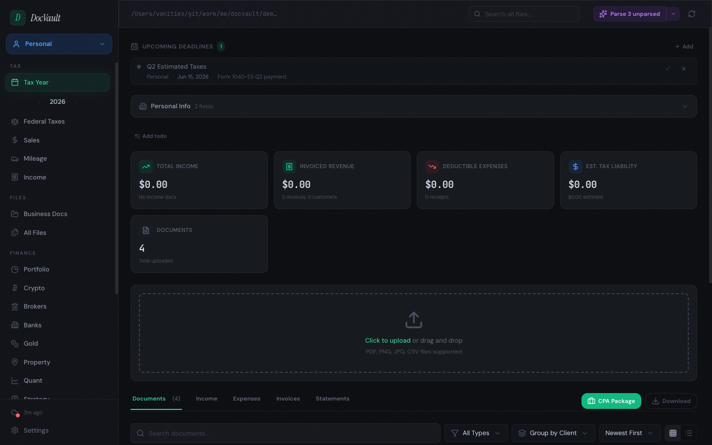

_Screenshots in this README are captured against the included `demo-data/` fixtures — the numbers, entities, and Strategy entry are fabricated._

## Try It Locally (Demo Mode)

Want to poke around before connecting real data? The repo ships with a `demo-data/` directory and a second Vite config that points the dev server at it.

```bash
bun install
# Terminal 1 — demo backend on port 3006, reading demo-data/
DOCVAULT_DATA_DIR=./demo-data DOCVAULT_PORT=3006 bun run server/index.ts
# Terminal 2 — demo frontend on port 5174, proxying /api to :3006
bun x vite --config vite.demo.config.ts
```

Open <http://localhost:5174> — full app, fake data. Your `./data/` stays untouched.

## Features

### Documents & Taxes

- **Multi-entity organization** — separate spaces for personal, LLCs, property, military, etc.
- **AI document parsing** — Claude Vision extracts structured data from W-2s, 1099s, K-1s, receipts, bank statements (~$0.003/page).
- **Auto file naming** — uploads are renamed to `{Source}_{Type}_{Date}.ext`.
- **Type-specific parsers** — 15 document-type parsers (W-2, 1099-NEC, K-1, statement, receipt, 1098, Koinly, Schedule C, etc.) normalize results into a single analytics module.
- **Federal tax summary** — Schedule C, K-1, capital gains, withholdings aggregated across all entities per year.
- **Solo 401(k) calculator** (IRS Pub 560 worksheet), estimated quarterly tracker, TN state view, mileage log, sales ledger, invoice tracking.
- **CPA package export** — one click to bundle an entity/year into a ZIP for your accountant.

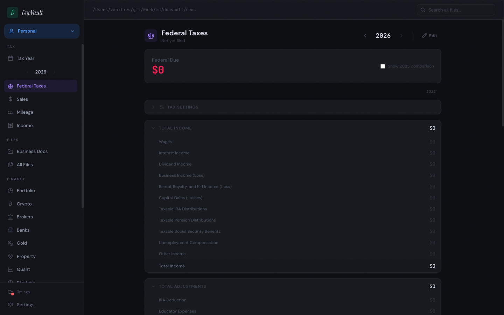

### Net Worth & Portfolio

- **Unified portfolio view** across every account — brokerage, crypto, banks, metals, real estate.
- **Automatic daily snapshots** with a historical net worth chart.
- **Broker aggregation via SnapTrade** (Fidelity, Vanguard, Robinhood, etc.) with per-account history.
- **Crypto exchange balances** (Kraken, Coinbase, Gemini) + **Etherscan wallet scanning** across mainnet, Arbitrum, Optimism, Polygon, and Avalanche.
- **Precious metals** with live spot prices.
- **Real estate** with cost basis, equity, and property-level notes.
- **Bank balances + transactions** via SimpleFIN Bridge (16,000+ US institutions).

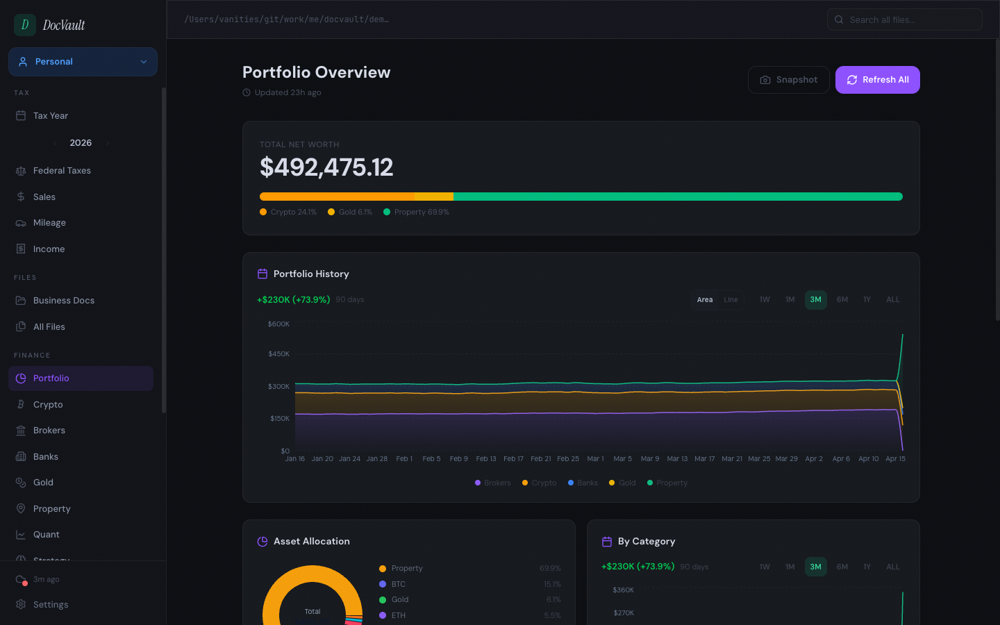

<table>
<tr>
<td>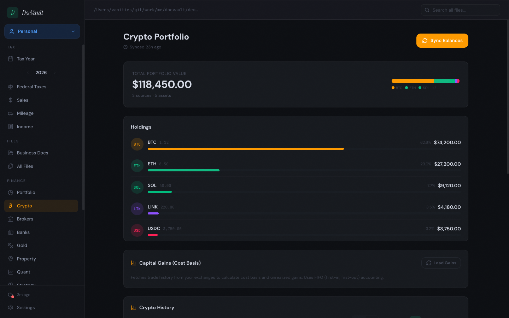</td>
<td>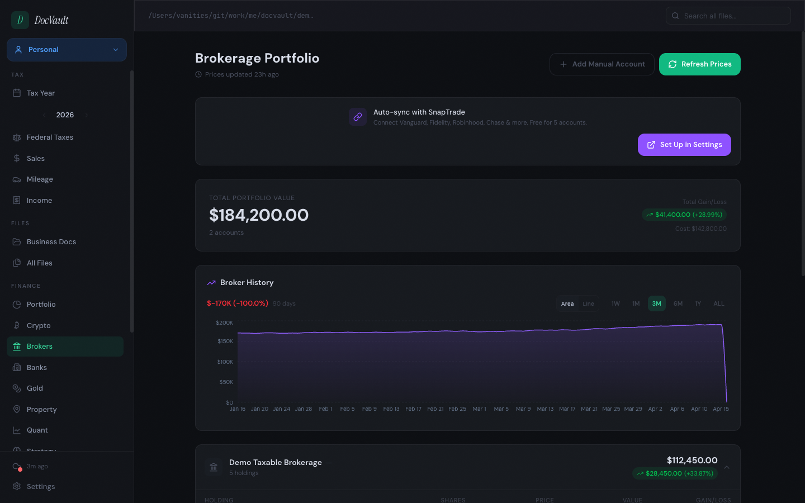</td>
</tr>
<tr>
<td>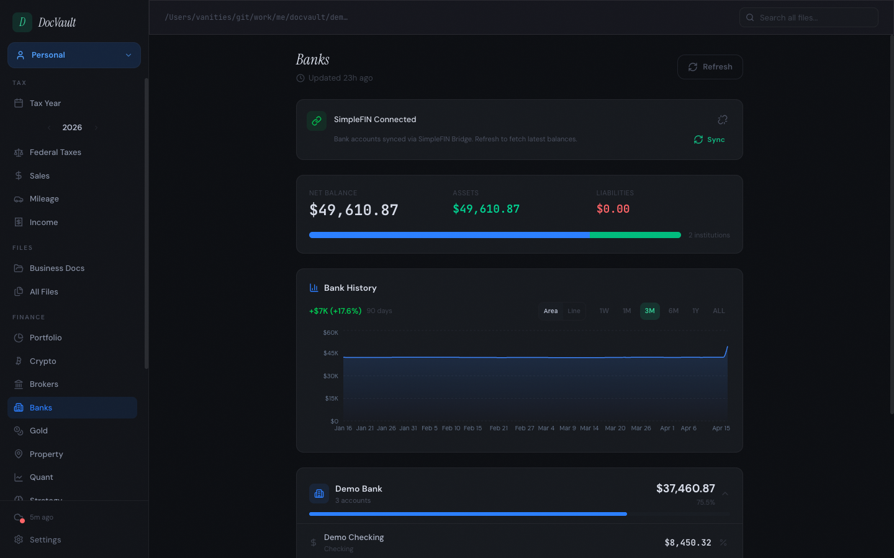</td>
<td>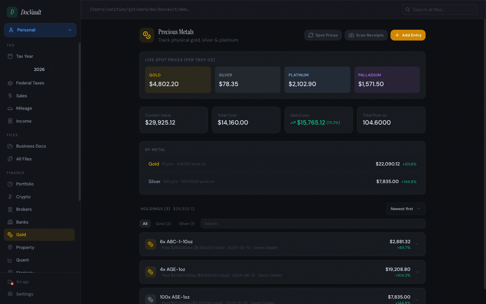</td>
</tr>
<tr>
<td colspan="2">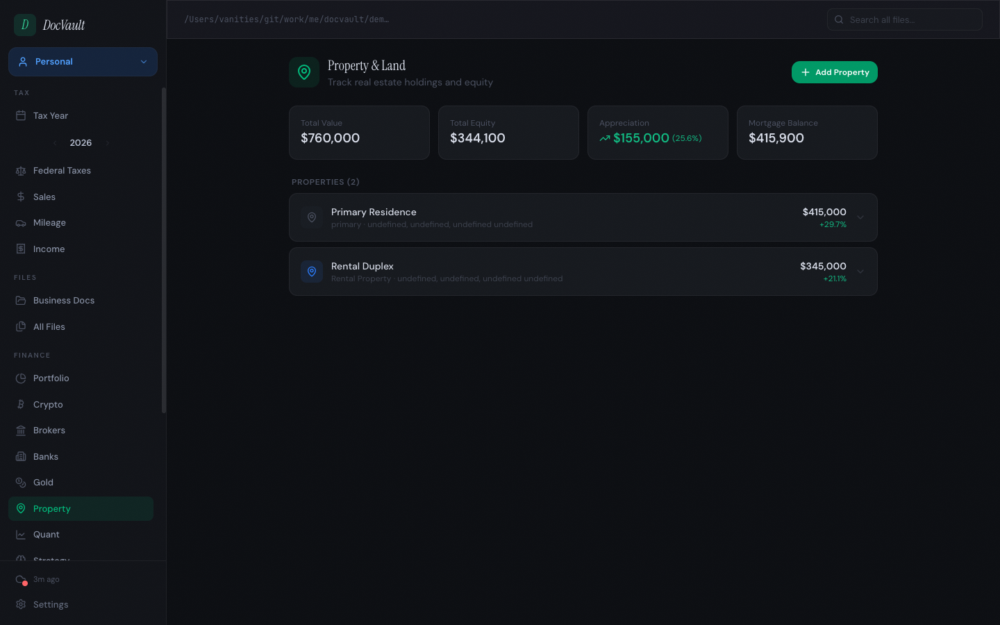</td>
</tr>
</table>

### Quant Dashboards & Strategy

- **Quant section** with 28 endpoints powering dashboards for crypto (BTC risk, hash ribbons, drawdown), macro (Sahm rule, yield curve, NFCI, fed stance, recession probability), housing, GDP & growth, commodities, VIX term structure, global markets, and an auto-generated macro event calendar.
- **Strategy history** — AI-generated investment strategy notes authored by Claude Code via a `/strategy` skill that reads your portfolio + current quant signals and saves a regime-aware recommendation. Entries render as expandable cards with a signal grid and full markdown analysis (tables, allocations, action plans). Dollar amounts and percentages in the markdown are obscured when "Blur financial numbers" is on.

<table>
<tr>
<td>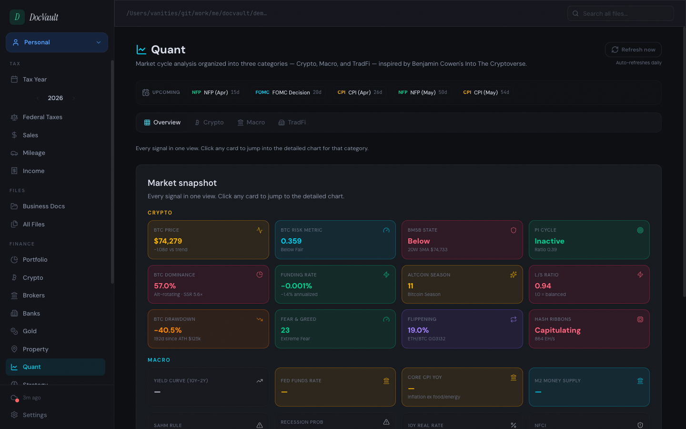</td>
<td>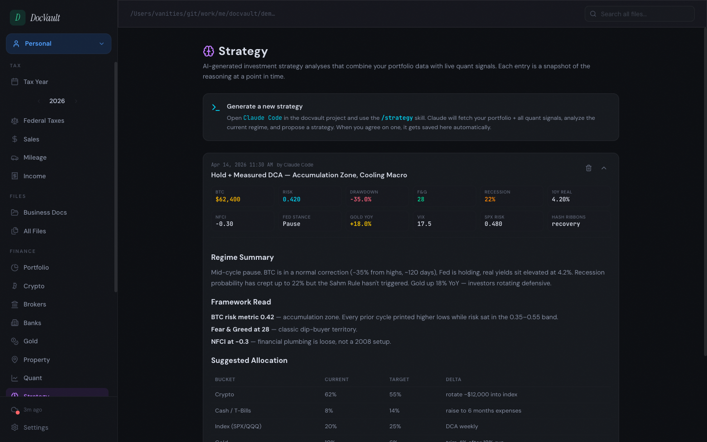</td>
</tr>
</table>

### Health (Apple Health)

- **iOS Shortcut daily sync** — a one-tap shortcut pushes HealthKit data to DocVault's `/api/health/ingest` endpoint.
- **Multi-person support** — each member of the household gets their own snapshot.
- **Overview + per-segment dashboards** — activity, heart, sleep, workouts, body composition.
- **Automatic illness detection** — rolling baseline over wrist temperature, heart rate, and HRV flags probable illness windows.
- Running ROI (vs BTC/SPX), workout segment insights, sleep quality scoring, recovery scoring.

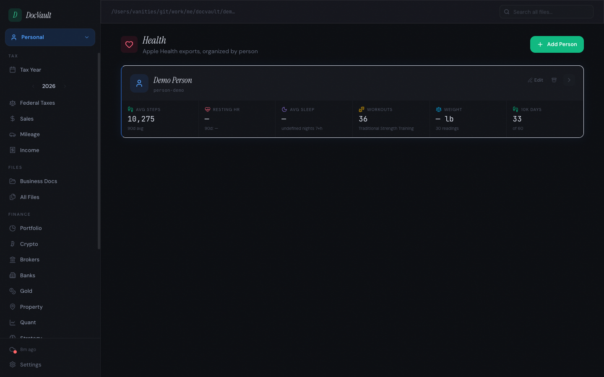

### Backup, Sync, Observability

- **Encrypted backup/restore** — AES-256-GCM zip of all config + parsed data, downloadable on demand.
- **Scheduled auto-backup** runs before each Dropbox sync.
- **Dropbox sync** — rclone-based one-way push of every entity folder on a configurable schedule (default 15 min).
- **Custom sync paths** — drop `.docvault-dropbox-map.json` to map entities to specific Dropbox folders.
- **Portfolio snapshot scheduler** + **Dropbox sync scheduler** configurable from Settings.
- **System Status panel** (Settings → System Status) — scheduler timers, next-run times, last error, and a live log viewer.

### Privacy

- **Blur financial numbers toggle** (Settings → Preferences) — obscures every dollar amount and percentage across the UI, including AI-generated markdown in the Strategy section.
- **Your data never leaves your machine** — no telemetry, no analytics, no remote database. One volume mount, one container.

### Other

- Mileage log with address autocomplete.
- Filing deadline reminders with recurring support.
- Username/password auth with session cookies.
- Docker-ready: single container, auto-published to GHCR (amd64 + arm64).

## Quick Start

```bash
bun install
bun start
```

Frontend: `http://localhost:5173` — Backend: `http://localhost:3005`

### Storage Setup

```bash
mkdir -p data/personal data/my-llc data/property
# or symlink existing folders
ln -s ~/Documents/taxes data/personal
```

## Docker

```bash
docker run -p 3005:3005 \
  -v /path/to/documents:/data \
  -e ANTHROPIC_API_KEY=sk-ant-... \
  -e DOCVAULT_PASSWORD=yourpassword \
  ghcr.io/vanities/docvault:latest
```

### Docker Compose

```yaml
services:
  docvault:
    image: ghcr.io/vanities/docvault:latest
    ports:
      - '3005:3005'
    volumes:
      - /path/to/documents:/data
    environment:
      - ANTHROPIC_API_KEY= # Required for AI parsing
      - DOCVAULT_USERNAME=admin # Default: admin
      - DOCVAULT_PASSWORD= # Required
    restart: unless-stopped
```

## Environment Variables

| Variable            | Required       | Description                             |
| ------------------- | -------------- | --------------------------------------- |
| `ANTHROPIC_API_KEY` | For AI parsing | Claude Vision API key                   |
| `DOCVAULT_USERNAME` | No             | Login username (default: `admin`)       |
| `DOCVAULT_PASSWORD` | Yes            | Login password                          |
| `DOCVAULT_DATA_DIR` | No             | Data directory path (default: `./data`) |
| `DOCVAULT_PORT`     | No             | Backend port (default: `3005`)          |

All integrations (SimpleFIN, SnapTrade, Etherscan, Kraken, Coinbase, Gemini, Dropbox) are configured through Settings and stored in `data/.docvault-settings.json`.

## Data Files

Everything lives in `DOCVAULT_DATA_DIR` as `.docvault-*.json` — mount one volume and the install is portable:

| File                                   | Purpose                           |
| -------------------------------------- | --------------------------------- |
| `.docvault-config.json`                | Entity definitions                |
| `.docvault-settings.json`              | API keys and integration config   |
| `.docvault-parsed.json`                | Cached AI parse results           |
| `.docvault-metadata.json`              | Document tags and notes           |
| `.docvault-reminders.json`             | Filing deadline reminders         |
| `.docvault-portfolio-snapshots-*.json` | Yearly portfolio snapshot history |
| `.docvault-broker-cache.json`          | Cached brokerage aggregation      |
| `.docvault-crypto-cache.json`          | Cached crypto balances            |
| `.docvault-simplefin-cache.json`       | Cached bank balances              |
| `.docvault-gold.json`                  | Precious metals holdings          |
| `.docvault-property.json`              | Real estate portfolio             |
| `.docvault-strategy-history.json`      | Saved Strategy entries            |
| `.docvault-health.json`                | Apple Health ingested data        |
| `.docvault-sync-status.json`           | Dropbox sync status               |

## Tech Stack

| Layer    | Technology                                   |
| -------- | -------------------------------------------- |
| Frontend | React 19 + TypeScript + Tailwind CSS (Vite+) |
| Backend  | Bun native server (`Bun.serve()`)            |
| Storage  | Local filesystem                             |
| AI       | Anthropic Claude Vision API                  |
| Health   | iOS Shortcuts + HealthKit ingest             |
| CI/CD    | GitHub Actions → GHCR                        |

## License

MIT
